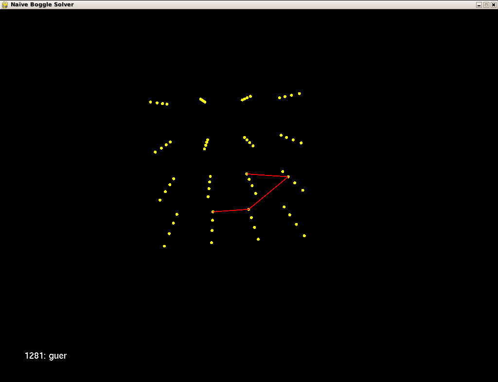

# 3-D Naive Boggle solver

- cubes.txt: `1,000 lines of 64 character 4x4x4 Cube objects.`
- flatten_3d_array_to_1d.py: `Proof of Concept used in (opengl|score)_pdq.py scripts.`
- opengl.py: `Animated representation of the Cube solving algorithm.`
- opengl_ftl.py: `2nd implementation of the Animated representation of the Cube solving algorithm.`
- opengl_pdq.py: `3nd implementation of the Animated representation of the Cube solving algorithm.`
- score.pl: `1st implementation of the Cube solving algorithm.`
- score.py: `2nd implementation of the Cube solving algorithm.`
- score_ftl.py: `3rd implementation of the Cube solving algorithm.`
- score_pdq.py: `4th implementation of the Cube solving algorithm.`
- words.txt: `Dictionary that comprises the search candidates.`

*3-D Boggle Animation*
